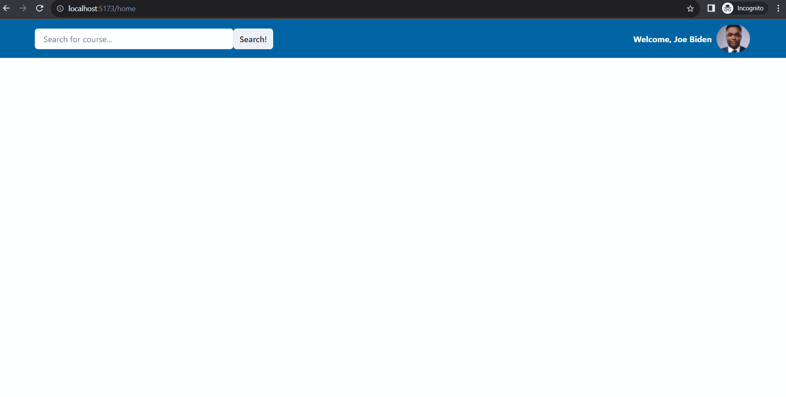

# [CourseNews]

CodePath WEB103 Final Project

Designed and developed by: Ostend Suryajaya and Steven Zhou

🔗 Link to deployed app:

## About

### Description and Purpose

CourseNews is a dedicated web application tailored to students at the University of California, Irvine (UCI) seeking comprehensive information and insights about the courses offered at the institution. Much like RateMyProfessors, CourseNews offers a centralized platform that simplifies the course selection process by aggregating reviews and ratings from students who have experienced these courses firsthand. CourseNews focuses exclusively on UCI's academic offerings, providing students with a one-stop destination to evaluate and choose their courses with confidence.

### Inspiration

The inspiration behind CourseNews stems from a deep understanding of the challenges and uncertainties that college students, particularly those at the University of California, Irvine, face when choosing their courses. We are UCI students who have experienced the frustration of selecting courses and professors blindly, often relying on hearsay or outdated information. We saw a need for a modern solution that could provide transparency, community-driven insights, and convenience in the course selection process.

## Tech Stack

Frontend: React

Backend: Node, Express, APIs tbd

## Features

### [Login] ✅

Users can login and navigate to the home page.

### [Course Ratings] ✅

Users will be able to leave a rating for this class.

### [Navigation Bar] ✅

Users will be able to search up a specific course. 

### [Home Page] ✅

Home page will show all the available courses that students can get reviews on.

### [Course Reviews] ✅

Users will be able to leave a review on a specific course for everyone else to see.

### [ADDITIONAL FEATURES GO HERE - ADD ALL FEATURES HERE IN THE FORMAT ABOVE; you will check these off and add gifs as you complete them]

## Installation Instructions

1. Pull the code from the repository
2. Install the needed packages
3. Run "npm run dev" to launch the app locally
